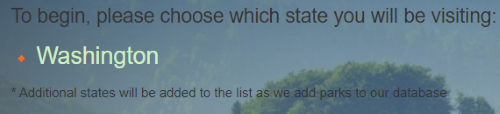
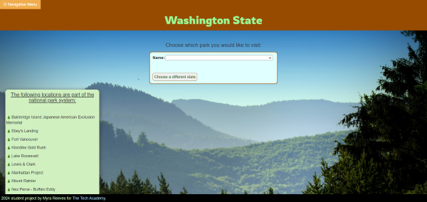
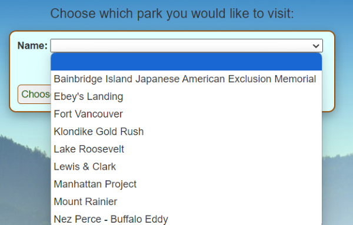
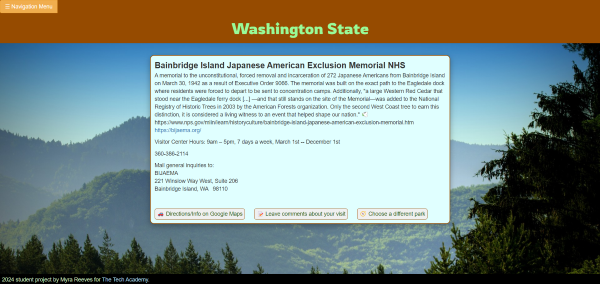
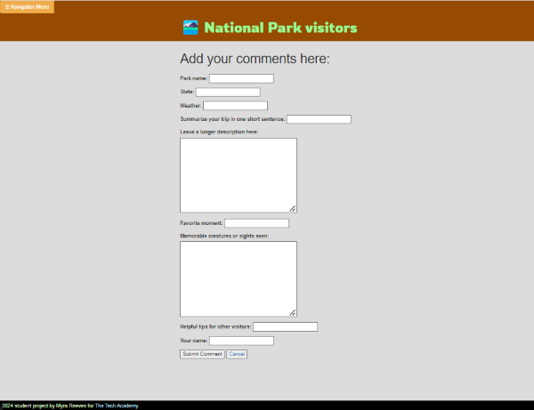
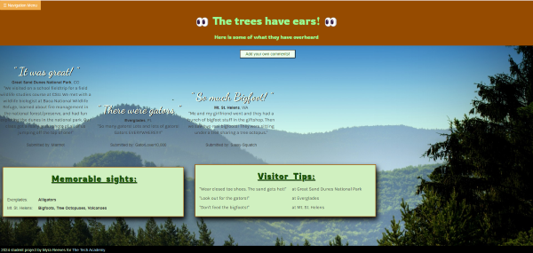

# 🎓 Tech Academy Capstone Project 🎓

## Introduction

The Appbuilder9000 website was created to help hobbyists keep track of their interests. This final student graduation project was to add apps to it using the Django framework and Python programming language.

 

## User Stories

### Story 1:

Ever since 1986, a nonprofit organization (Eastern National) has released sticker sets for National Park Service stores to sell and mailed free ink cancellation stamps to visitor centers around the United States, as part of their mission to encourage national park visitation and education.  
>_"As a hobbyist collector of those national park passport stamps/stickers who has recently moved to Washington state, I would like to be able to quickly find a list of all the national park system locations around my new home in order to add NPS passport products from all of them to my personal collection."_

### Story 2:

>_"As a local hiking enthusiast who enjoys sharing personal perspective about my adventures and reading the experiences of others, I want to be able to leave public comments after visiting a national park and read the visitation comments left by others."_

 

## Code Summaries

I added links to both a national park themed app and a comic book collection app onto the homepage and navigation menu for Appbuilder9000.

A "Washington Park" class was created so that all national park system locations inside the state of Washington could be saved to a database.  With the goal in mind of providing the general public with basic visitation information, database fields inside the table included park name, park type, location, basic contact information, visitor center hours, and a brief park description including links to the official, U.S. government-run informational websites.  To preserve informational accuracy and discourage tampering, access to CRUD control of this database table was restricted to dev team admins, with the data inside being read-only to the general public.

The landing page for the national park app was designed such that park locations in other states could be added in the future.

### _Screenshots of the app's GUI for users to view park information stored in the database:_

App landing page:

Zoomed-in view of state selection area within landing page:

 

Washington state webpage:

Close-up of park selection dropdown on the Washington state webpage:

Fullscreen view of a selected park's information being displayed to a user:

 

Creation and Read access was granted to users via HTML pages.

### _Screenshots of the GUI for users to create and read visitor comments:_

Zoomed-in view of visitor comment link within app landing page:

Screenshot of webpage form for users to create a new entry within the Visitor Comment database:

Fullscreen view of the webpage where users are able to read Visitor Comment information stored within the database:

CRUD control was provided to users via HTML pages.

If you want to learn more about creating good readme files then refer the following [guidelines](https://docs.microsoft.com/en-us/azure/devops/repos/git/create-a-readme?view=azure-devops). You can also seek inspiration from the below readme files:
- [ASP.NET Core](https://github.com/aspnet/Home)
- [Visual Studio Code](https://github.com/Microsoft/vscode)
- [Chakra Core](https://github.com/Microsoft/ChakraCore)
