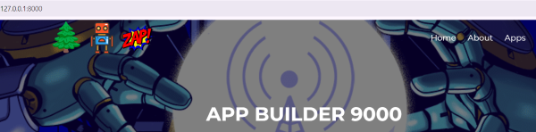

# 🎓 Tech Academy Capstone Project 🎓

## Introduction

The Appbuilder9000 website was created to help hobbyists keep track of their interests. This final student graduation project was to add apps to it using the Django framework and Python programming language.

 

## User Stories

### Story 1:

Ever since 1986, a nonprofit organization (Eastern National) has released sticker sets for National Park Service stores to sell and mailed free ink cancellation stamps to visitor centers around the United States, as part of their mission to encourage national park visitation and education.  
>_"As a hobbyist collector of those national park passport stamps/stickers who has recently moved to Washington state, I would like to be able to quickly find a list of all the national park system locations around my new home in order to add NPS passport products from all of them to my personal collection."_

### Story 2:

>_"As a local hiking enthusiast who enjoys sharing personal perspective about my adventures and reading the experiences of others, I want to be able to leave public comments after visiting a national park and read the visitation comments left by others."_

### Story 3:

> _"As an avid collector of comic books, I would like an app to help me keep track of my ever-changing collection. I need the ability to add newly acquired comics to my inventory list and delete others as I trade or sell them.  Links to websites where I can research the monetary value of previously acquired or future desired copies would be very helpful to me.  To avoid mistakes occurring in my collection list, please allow me to edit my collection entries and ask me for confirmation before I delete an item from the database."_

 

## Code / Project Build Description

I added links to both a national park themed app and a comic book collection app into the app directory and top navigation icon menu of the Appbuilder9000 homepage. The pages of each app also included a dropdown navigation menu in the upper left corner using Bootstrap codes.

Screenshots of these navigation links:

~ . ~ . ~ . ~ . ~ .

~ . ~ . ~ . ~ . ~ .

Initial tests of my apps indicated difficulty for users when attempting to select the first database entry via an HTML dropdown menu.  As a quick and easy fix to this problem, the first entries in all database tables were left blank and If/Else code statements were used within all code loops to skip displaying any information from those blank entries on the database content viewing pages. The code was written so that if a user accidentally selects the blank/dummy entry at the top of a list, the web browser will automatically redirected to remain on the same page, thereby appearing to the user as if nothing happened.

### National Park App - Phase One

A "Washington Park" class was created so that all national park system locations inside the state of Washington could be saved to a database.  With the goal in mind of providing the general public with basic visitation information, database fields inside the table included park name, park type, location, basic contact information, visitor center hours, and a brief park description including links to the official, U.S. government-run informational websites.  To preserve informational accuracy and discourage tampering, access to CRUD control of this information was restricted to dev team admins, with the data inside being read-only to the general public.

The landing page for the national park app was designed such that park locations in other states could be added in the future.

### _Screenshots of the app's GUI for users to view park information stored in the database:_

App landing page:

 

Zoomed-in view of state selection area within landing page:

 

Washington state webpage:

Close-up of park selection dropdown on the Washington state webpage:

Fullscreen view of a selected park's information being displayed to a user:

 

 

### National Park App - Phase Two

A "Visitor Comment" class was created for storing visitation notes added by users.  Since the intention of the national park app is that it will eventually be expanded in the future to include all parks in all U.S. states, I designed the comments section to be useable for any NPS location.  Comment input fields include experiential information such as memorable sights/descriptions of the user's visit, user-generated tips for other park visitors, etc., in addition to more measurable/quantifiable data such as which specific park had been visited, what the weather had been like, etc.  Creation and Read access was granted to users via HTML page interfaces.  To discourage potential tampering by malicious individuals, edit Updates and Deletion control was reserved only for dev admins.

### _Screenshots of the GUI for users to create and read visitor comments:_

Zoomed-in view of visitor comment link within app landing page:

 

Screenshot of webpage form for users to leave a new entry within the Visitor Comment table:

 

Fullscreen view of the webpage where users are able to read the Visitor Comment information stored within the database:

 

 

### Comic Book Collection App - Phase One

A "Comicbook Collection" class was created so that users of this separate, second app can save the details of their comic book collection to a database.  To address the most common identification details, the model included fields for publisher, series title, volume number, issue number, and year of publication. The landing page of the app included a user button for adding new entries, a visual list of all titles/issues currently saved in the user's collection database (database is pre-loaded with two demonstration examples), a drop-down access panel for editing or deleting entries from the user's collection, and button links for accessing a variety of external websites that appraise the monetary value of comic books. The app was designed so that, when using those appraisal buttons, the external links open in a new browser tab. CRUD control of the comic book collection app database contents was provided to users via a series of HTML form pages.

### _Screenshots of the GUI for users to create, read, update, or delete comic books from their collection list:_

Screenshot of the app's landing page:

Close-up view of button links at bottom of page leading to external websites:

 

Close-up view of the button for a user to add a new entry into their collection's database. This screenshot shows the CSS effect of hovering over the button:

 

The "Add" webpage with form for a user to submit a new entry:

 

Close-up of the drop-down selection box on the app's landing page so that a user can select an entry to read, edit, or delete it. This screenshot also shows the CSS hover effect:

 

Screenshot of the "Edit Comic" webpage form:

 

Screenshot of "Confirm Delete" webpage:

 

 

## Future Planned Additions

As time permits in the future, I would like to add API and data scraping information to the apps, such as current weather conditions at a selected national park or a list of in-demand comic books currently for sale on an auction website.
